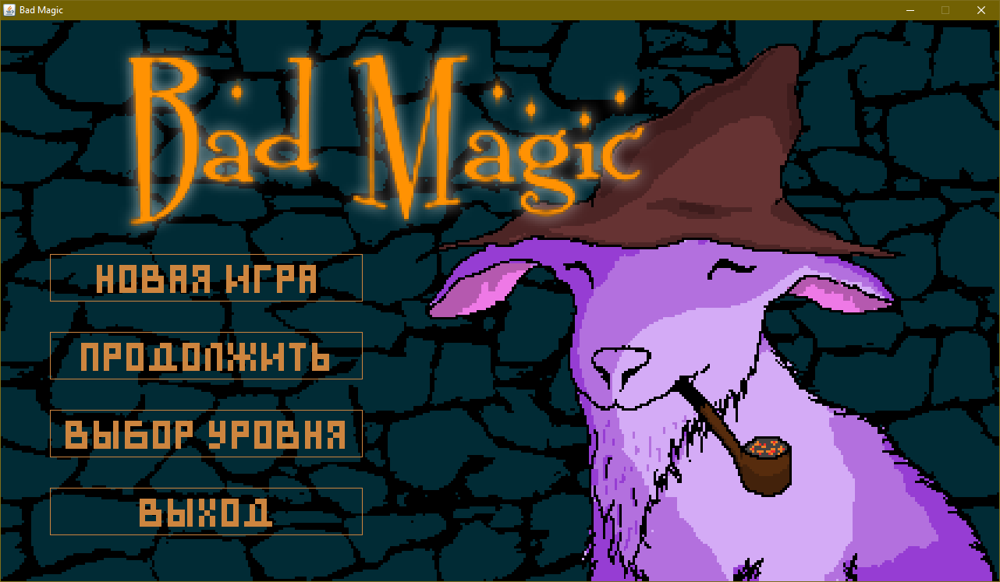
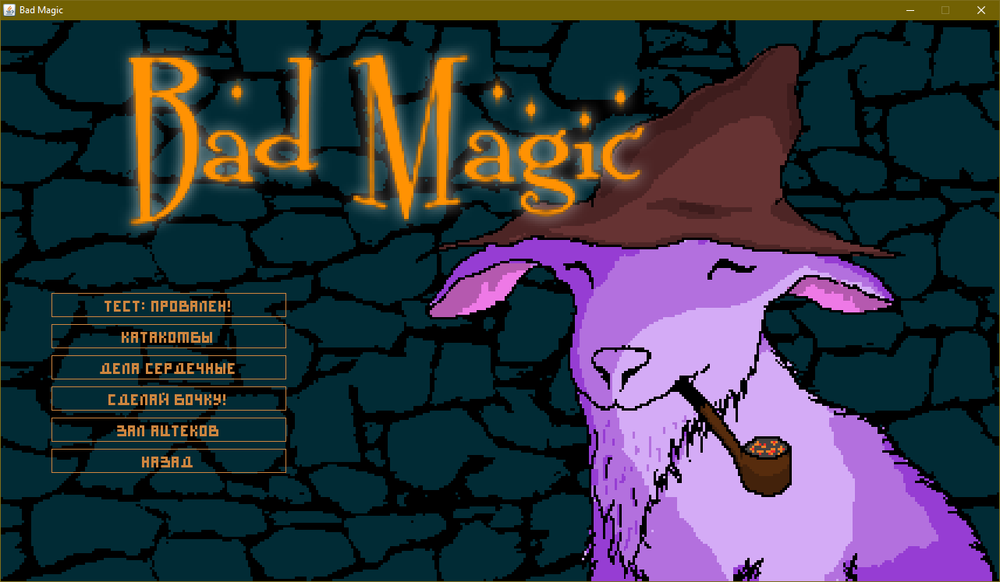
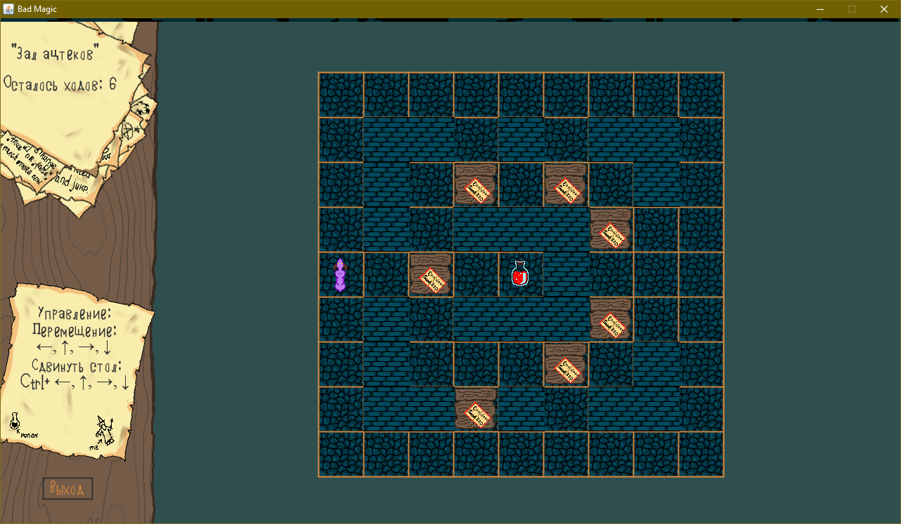

# Bad Magic
Простая пошаговая 2D игра на Java.

Главный герой - магический козел. Цель игры - пройти лабиринт и заполучить элексир. 
В лабиринте могут встречаться непроходимые стены и предметы, которые можно передвигать. 
Количество ходов главного героя ограничено. 
В игре есть режим кампании с последовательным прохождением всех уровней, а также возможность запустить любой из уровней. Прогресс игрока сохраняется.

Управление:
- Перемешение главного героя: ← → ↑ ↓
- Перемешение предмета: Ctrl + ← → ↑ ↓ (главный герой должен находиться лицом к предмету)

Модификации:
- [chain-and-pot-mod](https://github.com/petrenko-alex/bad-magic-game/tree/chain-and-pot-mod) - модификация игры с дополнительными передвигаемыми предметами
- [teleport-mod](https://github.com/petrenko-alex/bad-magic-game/tree/teleport-mod) - модификация игры с ключами и телепортами

Проект написан на языке Java с использованием Swing.  
JDK 1.8.0u202

