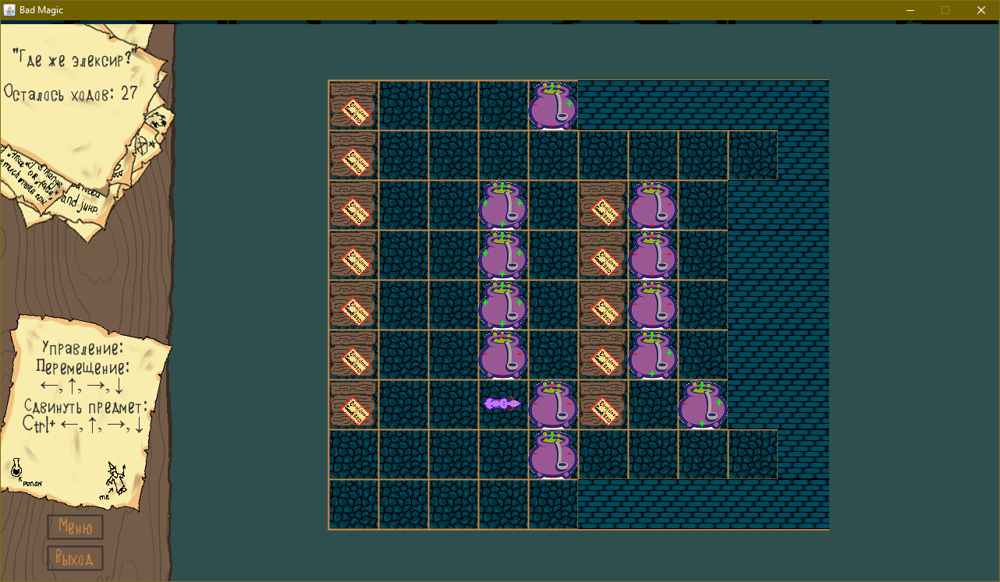

# Chain and Pot mode для BadMagic

Модификация игры BadMagic с дополнительными передвигаемыми предметами:
* Магнитный котел
* Сундук со сцепкой

На каждой стороне магнитного котла обозначен полюс (+ или -). При перемещении котлов они притягиваются или отталкиваются в зависимости от полюса. Область действия магнитного поля - 1 клетка.

Если сундук со сцепкой находится рядом с другим таким сундуком. То перемещается вся сцепка сундуков. Перемещение сцепки возможно, если все сундуки могут быть передвинуты в указанном направлении.

Добавлены новые уровни для демонстрации дополнительных предметов.

